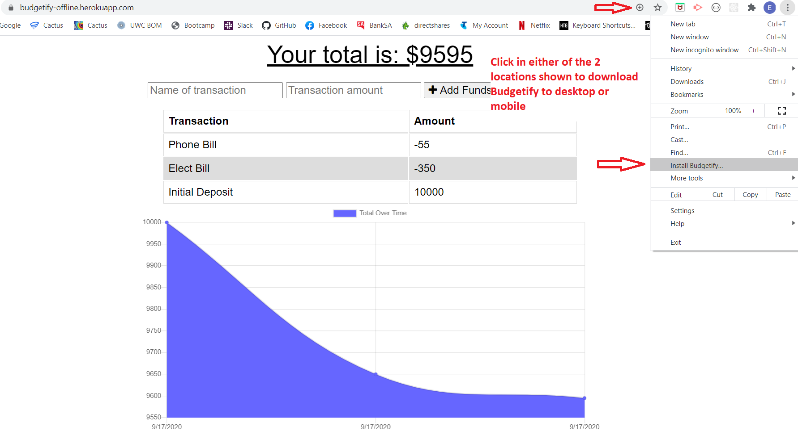
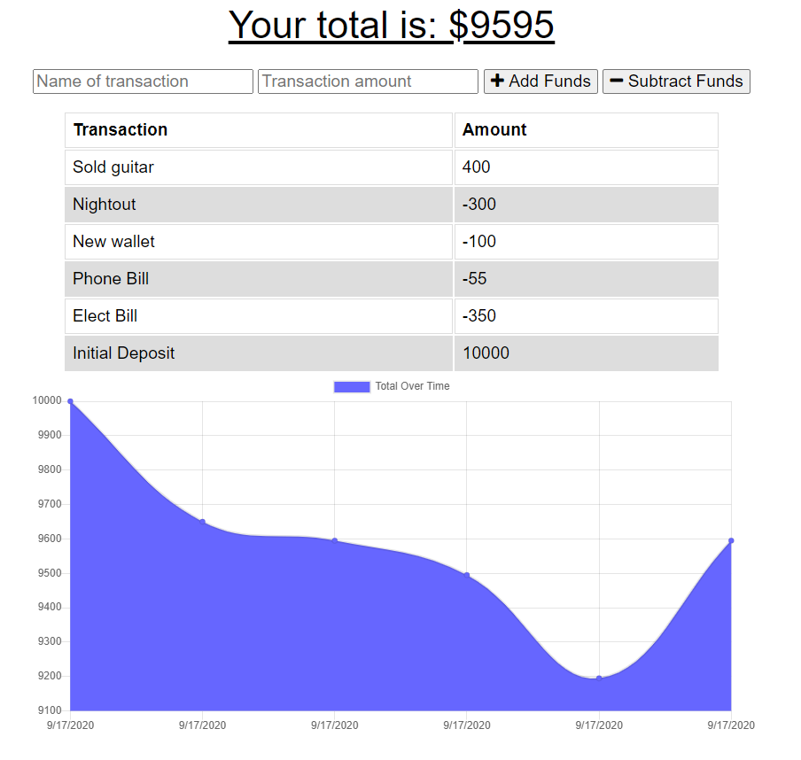

# Budgetify 
  

  ## Description ✏️
  
  Budgetify is a PWA that allows you to keep track of your incoming and outgoing funds.  Budgetify was created with the user in mind so that it is fully functional with no internet connection.
  
  ## Table of Contents 📚
  
  * [Installation](#installation)
  * [Usage](#usage)
  * [License](#license)
  * [Contributing](#Contributing)
  * [Testing](#Testing)
  * [Questions](#Questions)
  
  ## Installation 

  ```
  📥 Follow the link to the deployed app below and click download on the button in the browser to have it work offline.  See picture below for details.
  ```
[Click Here](https://budgetify-offline.herokuapp.com/) to access Budgetify



  ## Usage 

  ```
  ▶️ The user opens the app is able to enter a transaction name and transaction amount.  The user can then add the funds or subtract the funds from the displayed total.  The graph will display all transaction over time.
  Budgetify has been created so the user can work offline in areas of poor internet connectivity with no loss of functionality.  Budgetify will automatically sync with cloud database once a connection has been restored and there is no need for the user to do anything.
  The user also has the choice of downloading Budgetify to take advantage of its PWA technologies.  
  ```


  ## License 
  
  📜 License Code: MIT

  For detailed information on license [Click Here](https://opensource.org/licenses/MIT)
  
  ## Contributing
  
  👌 No contributions required
  
  ## Testing 

  ```
  ✔️ Ensure that the total updates when entering funds.  To test the offline capabilities switch of Wi-Fi or turn mobile to flight mode and use app as normal.  There should be no changes to how the app operates.  Re-connect to internet and the data should be the same.
  ```

  ## Questions 
  
  Direct questions to me via email 📧 at [tmoschos@bigpond.com](tmoschos@bigpond.com).  Please use "Budgetify questions" in the subject and I will hopefully return a response within 48hrs.

  More information can be found at my [GitHub Profile](https://github.com/EMoshcos).
  
---
This README was created by the "Great-Read" 📝 Node.js app.  Developed by Eleftherios Moschos
